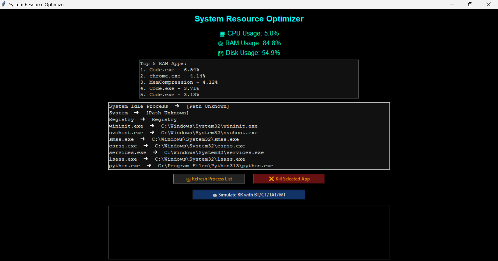
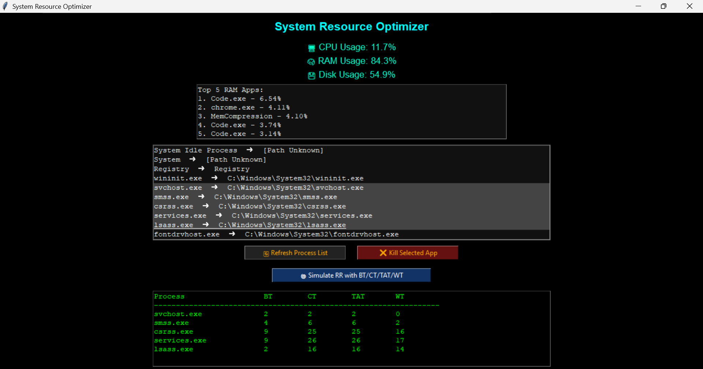
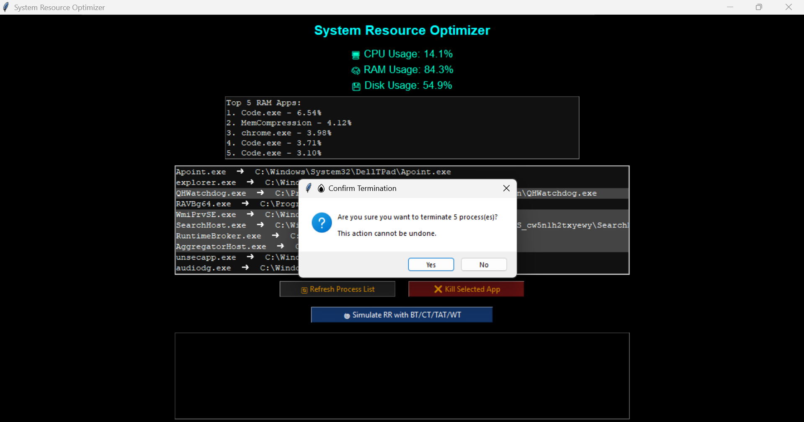
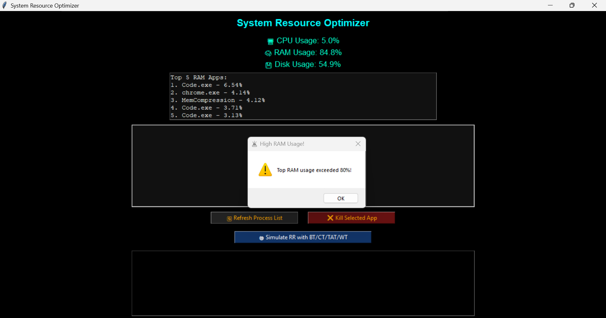

# 🧠 System Resource Optimizer

**System Resource Optimizer** is a Python-based desktop application that allows users to monitor system performance, manage processes, and simulate CPU scheduling using the Round Robin algorithm. It features a real-time system dashboard and tools to terminate resource-hungry processes directly from the GUI.

---

## 🚀 Features

- 🖥 **Live Monitoring** of CPU, RAM, and Disk usage
- 🔍 **Top 5 RAM-consuming processes** display
- ✅ **Terminate** selected non-critical apps safely
- 🌀 **Simulate Round Robin Scheduling**:
  - Shows Burst Time (BT), Completion Time (CT), Turnaround Time (TAT), and Waiting Time (WT)
  - Random burst time assigned for demo simulation
- 🔁 **Refreshable Process List** with full paths
- 🛡️ Protects critical system processes from termination
- ⚠️ **RAM Alerts** when usage exceeds 80%

---

## 📷 Screenshots

### 🖥️ Dashboard View


### 🌀 Round Robin Simulation


## 📷 Screenshots

### 🖥️ Kill Process


### 🌀 Ram Warning


---

## 🛠️ Tech Stack

| Component        | Technology        |
|------------------|-------------------|
| Language         | Python 3.x        |
| GUI Library      | Tkinter           |
| System Access    | psutil            |
| Notifications    | tkinter.messagebox |

---

## 📂 Folder Structure

SystemResourceOptimizer/
├── main.py # Main application script
├── README.md # Project documentation
├── assets/ # (Optional) Screenshots or icons


---

## 🧑‍💻 How to Run the App

1. **Clone the Repository**
   ```bash
   git clone https://github.com/yourusername/SystemResourceOptimizer.git
   cd SystemResourceOptimizer
2. Install Dependencies
3. Run the App: python main.py

## ⚙️ How It Works
**🔄 Round Robin Scheduling Simulation**
Select exactly 5 processes from the list.

Click "**🌀 Simulate RR with BT/CT/TAT/WT**"

Each process is assigned a random burst time (1-10 units).

A time quantum of 4 is used for fair CPU sharing.

Output includes process scheduling results.

## ❌ Process Termination
Select one or more processes.

Click "**❌ Kill Selected App**"

System-critical processes like System, csrss.exe, svchost.exe, etc., are protected.

User is prompted with a confirmation box before termination.

## 📌 Notes
Works best on Windows OS

Must be run with sufficient permissions to terminate processes

The RR simulation is for educational purposes (not tied to actual CPU scheduling)


## 👩‍🎓 Author
Gauri Chorge,Palak Adsul
Computer Science Student
GitHub: github.com/Gauriop
